

  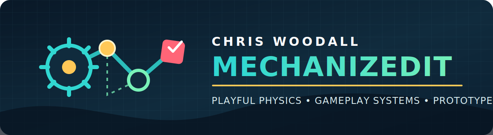

  I am a game developer and rapid prototyper who turns unusual mechanics into clear, playable experiences. 
  My work spans shipped level content, mobile and web games, social worlds, and experimental creative software.

  <strong>Available for remote contract work</strong> in gameplay prototyping, level design, game development, and AI-assisted product development.

  <a href="mailto:mechanizedit@gmail.com"><strong>Email me</strong></a> ·
  <a href="https://itch.io/profile/mechanizedit">Play my games</a> ·
  <a href="https://github.com/MechanizedIT?tab=repositories">Explore my code</a>

<table align="center" width="100%">
  <tr>
    <td align="center" width="20%"><h3 align="center">⚙️ Prototyping</h3>
Ideas into playable truth
</td>
    <td align="center" width="20%"><h3 align="center">🧲 Game Physics</h3>
Construction & interaction
</td>
    <td align="center" width="20%"><h3 align="center">🧩 Level Design</h3>
Pacing, challenge & variety
</td>
    <td align="center" width="20%"><h3 align="center">📱 Cross-Platform</h3>
Mobile, web & social worlds
</td>
    <td align="center" width="20%"><h3 align="center">✨ Creative AI</h3>
Tools & product experiments
</td>
  </tr>
</table>

<code>Unreal Engine</code> · <code>Unity</code> · <code>Godot</code> · <code>C#</code> · <code>C++</code> · <code>Blueprint</code> · <code>Lua</code> · <code>TypeScript</code>

---

## Fancade · Professional Game Development

I worked with **Fancade for nearly two years**, developing gameplay prototypes and creating extensive level content for published games. The role combined rapid experimentation with disciplined content production: learning an established game's design language, finding new possibilities inside a compact ruleset, and turning them into challenges that still felt native to the product.

<table>
  <tr>
    <td align="center" width="33%"><h2>Nearly 2 years</h2>working with Fancade</td>
    <td align="center" width="33%"><h2>≈ 200 levels</h2>designed and iterated</td>
    <td align="center" width="33%"><h2>Prototype → Polish</h2>mechanics, pacing & progression</td>
  </tr>
</table>

### Featured contribution · Drive Mad

<a href="https://poki.com/en/g/drive-mad">
  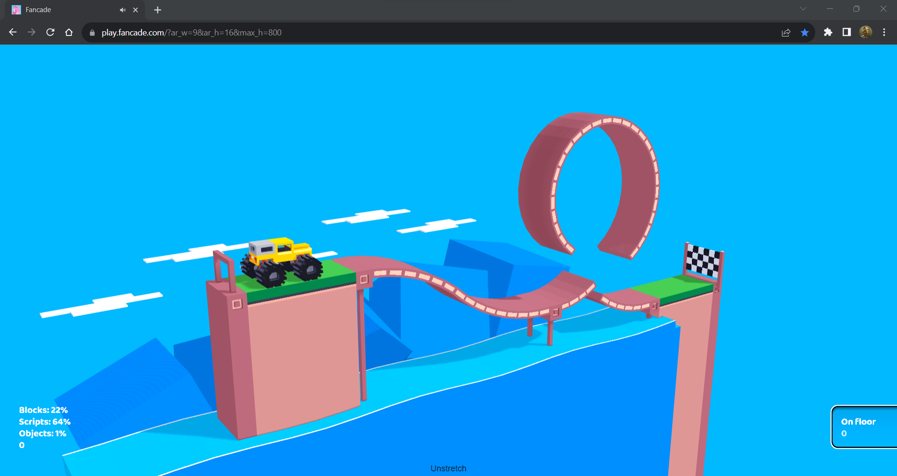
</a>

For *Drive Mad*, I designed and iterated approximately **200 levels for later content**, shaping difficulty, pacing, mechanical variation, and progression around the game's two-button physics. I explored edge cases in the driving model and turned those discoveries into readable challenges—from unusual terrain and vehicles to timing, balance, and mechanical set pieces.

The public game now spans 250 levels and has been played more than 300 million times, according to the figures reported on its public game page.

> **My contribution:** later level content and prototyping 
> **Original game:** Martin Magni / Fancade

[**Play Drive Mad →**](https://poki.com/en/g/drive-mad)

### Original Fancade work · Brain in a Jar

<table>
  <tr>
    <td width="28%" valign="middle">
      <a href="https://play.fancade.com/615B540FBE61F08E">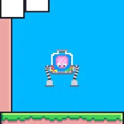</a>
    </td>
    <td width="72%" valign="middle">
      <h2>Two arms. Two control schemes. One fragile brain.</h2>
      
<em>Brain in a Jar</em> is an original, deliberately awkward physics-platforming experiment published under MechanizedIT. Each arm is controlled independently, turning simple movement into a coordination puzzle.

      
<a href="https://play.fancade.com/615B540FBE61F08E"><strong>Play in your browser →</strong></a>

    </td>
  </tr>
</table>

---

## Selected Independent Work

<table>
  <tr>
    <td width="38%" valign="top">
      <a href="https://mechanizedit.itch.io/block-mechanics">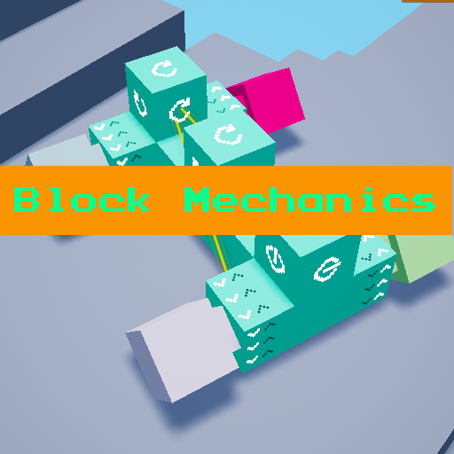</a>
    </td>
    <td width="62%" valign="top">
      <h2>Block Mechanics</h2>
      <h4>Designer & Developer · Unreal Engine / Blueprint</h4>
      
A 3D contraption-building game where players connect blocks, motors, and controls to solve physics puzzles. I designed the building system, implemented the interactions and mobile controls, and published playable Windows and Android prototypes.

      
<strong>Focus:</strong> physics-driven systems · construction tools · mobile interaction

      
<a href="https://mechanizedit.itch.io/block-mechanics"><strong>Download the prototype</strong></a> · <a href="https://www.youtube.com/watch?v=QsvBwYt7BpM">Watch gameplay</a>

    </td>
  </tr>
</table>

 

<table>
  <tr>
    <td width="62%" valign="top">
      <h2>Inkspark</h2>
      <h4>Full-Stack AI Product Prototype</h4>
      
An AI-assisted interactive storytelling application for planning stories, developing characters, and exploring narrative through character conversations. The prototype combines a Next.js and TypeScript interface with rich-text editing, Supabase, and AI integrations.

      
<strong>Focus:</strong> product prototyping · creative tools · AI-assisted interaction

      
<a href="https://github.com/MechanizedIT/inkspark"><strong>View the repository</strong></a> · <a href="https://www.youtube.com/shorts/86ppcgBDFpA">Watch the demo</a>

    </td>
    <td width="38%" valign="top">
      <a href="https://www.youtube.com/shorts/86ppcgBDFpA">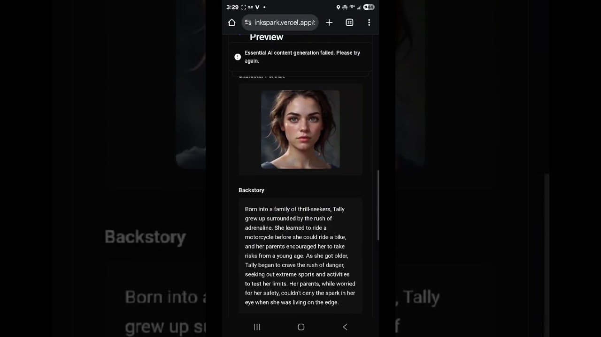</a>
    </td>
  </tr>
</table>

---

## Worlds Built for Meta Horizon

These projects explore progression, construction, and approachable game loops inside social, cross-device worlds.

<table>
  <tr>
    <td width="33%" valign="top">
      <a href="https://horizon.meta.com/world/10172690463285008/?locale=en_US">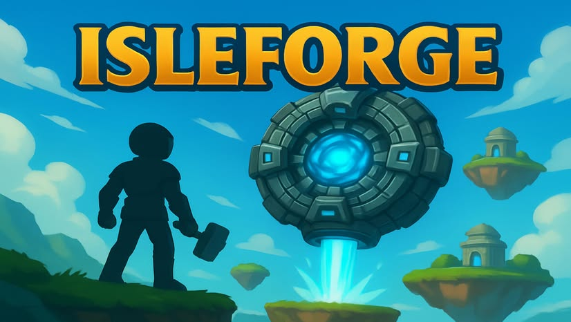</a>
      <h2>IsleForge</h2>
      
A floating-island adventure built around discovery and forging.

      
<a href="https://horizon.meta.com/world/10172690463285008/?locale=en_US"><strong>Visit world</strong></a> · <a href="https://youtu.be/gyHaXbOMGEo">Video</a>

    </td>
    <td width="33%" valign="top">
      <a href="https://horizon.meta.com/world/10173045618865008/">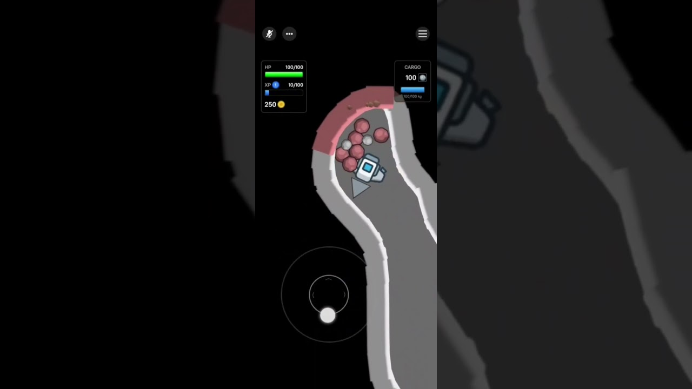</a>
      <h2>Asteroid Minder</h2>
      
A top-down asteroid-mining prototype with resources, cargo, and progression.

      
<a href="https://horizon.meta.com/world/10173045618865008/"><strong>Visit world</strong></a> · <a href="https://www.youtube.com/shorts/cYv3j8RiUPM">Video</a>

    </td>
    <td width="33%" valign="top">
      <a href="https://horizon.meta.com/world/10171115192965008/">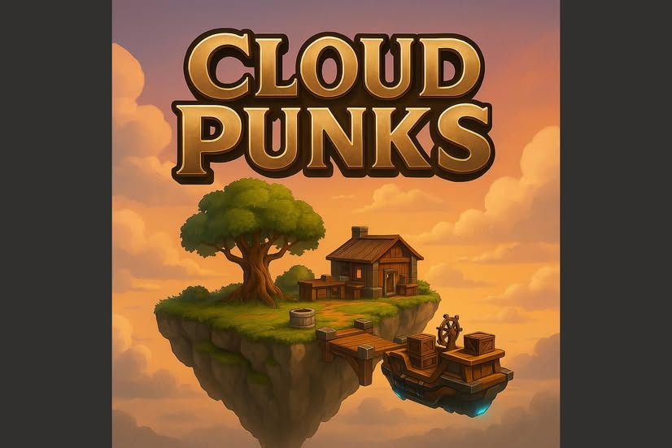</a>
      <h2>Cloud Punks</h2>
      
A steampunk sky-pirate sandbox: pilot and upgrade an airship, build, and harvest resources.

      
<a href="https://horizon.meta.com/world/10171115192965008/"><strong>Visit world</strong></a> · <a href="https://www.youtube.com/shorts/KDUetnX9-8I">Video</a>

    </td>
  </tr>
</table>

<h2>More Playable Experiments</h2>

 
<table>
  <tr>
    <td width="33%" valign="top">
      <a href="https://www.youtube.com/watch?v=cTIgGUYqOVE">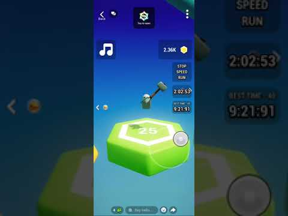</a>
      <h3>Hammer Obby</h3>
      
A mobile obstacle-course experiment created with HypeHype.

      
<a href="https://www.youtube.com/watch?v=cTIgGUYqOVE">Gameplay</a> · <a href="https://www.youtube.com/watch?v=DEYN6YenROk">Promo</a>

    </td>
    <td width="33%" valign="top">
      <a href="https://www.coregames.com/games/e28897/spacepunks-tycoon">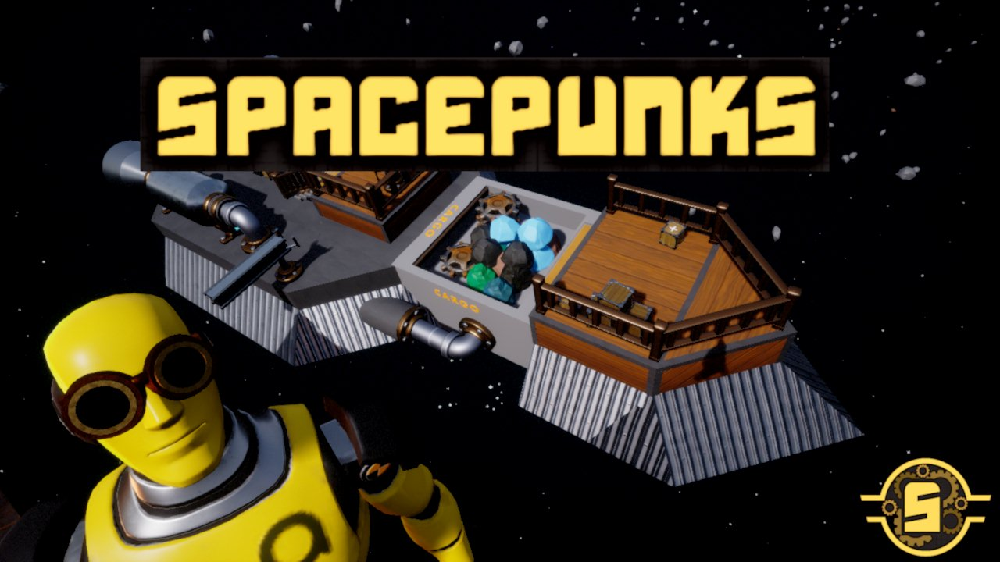</a>
      <h3>Spacepunks Tycoon</h3>
      
A space-mining and ship-combat prototype built in Core.

      
<a href="https://www.coregames.com/games/e28897/spacepunks-tycoon">Play</a> · <a href="https://www.youtube.com/watch?v=tgjsFzzGOE8">Video</a>

    </td>
    <td width="33%" valign="top">
      <a href="https://www.coregames.com/games/5b21ce/doge-force-lunar-patrol">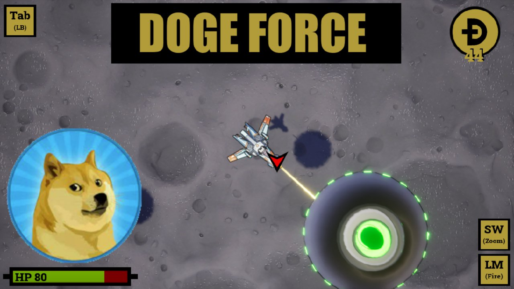</a>
      <h3>Doge Force</h3>
      
A top-down lunar patrol and combat game built in Core.

      
<a href="https://www.coregames.com/games/5b21ce/doge-force-lunar-patrol">Play</a>

    </td>
  </tr>
</table>

---

## How I Work

I am most useful where a project needs to move from **idea to playable truth**. I prototype the riskiest interaction early, build the supporting systems, and iterate until the mechanic communicates itself.

I am comfortable joining an existing project, learning its design language and technical constraints, and producing work that fits the established mechanics and player experience.

- **Rapid prototypes** — test the core interaction before investing in the edges
- **Physics and construction systems** — make complex interactions understandable and satisfying
- **Level and content iteration** — build difficulty, variety, and progression from a focused ruleset
- **Cross-platform interaction** — design for mobile, web, desktop, and social spaces
- **Practical planning** — turn broad ideas into bounded, buildable development plans

## Currently Exploring

- **Project Forge** — a visual planning environment for turning complex ideas into practical roadmaps and working effectively with AI development agents.
- **Deterministic contraptions** — a Godot and C# experiment with rods, wheels, motors, obstacles, and reproducible physics-driven construction.

---

<h2>Have an unusual mechanic that needs to become playable?</h2>

<strong>Available for contract game development, gameplay prototyping, level design, and project reviews.</strong>

<h3><a href="mailto:mechanizedit@gmail.com">mechanizedit@gmail.com</a></h3>

  <a href="https://github.com/MechanizedIT">GitHub</a> ·
  <a href="https://itch.io/profile/mechanizedit">itch.io</a> ·
  <a href="https://play.fancade.com/615B540FBE61F08E">Play my Fancade work</a>

