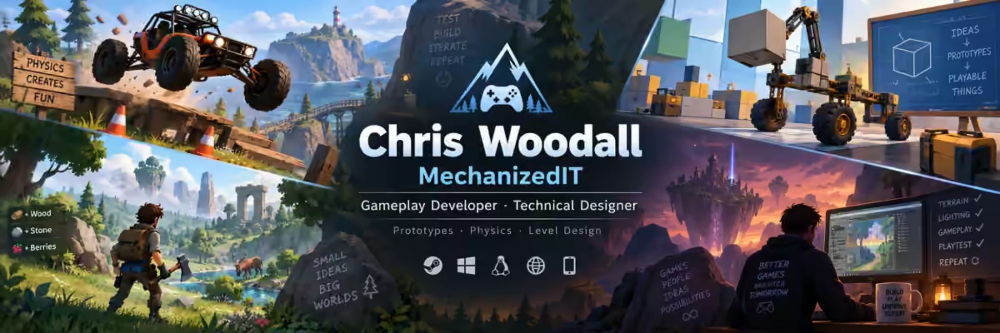

  

  I'm Chris, a gameplay developer and technical designer. 
  I build physics-driven mechanics, playable prototypes, and levels.

  <strong>Open to remote employment, contracts, and part-time collaboration.</strong> 
  Illinois, USA · US Central time

  <a href="mailto:mechanizedit@gmail.com"><strong>Contact me</strong></a> ·
  <a href="mailto:mechanizedit@gmail.com?subject=Resume%20request">Request my resume</a> ·
  <a href="https://itch.io/profile/mechanizedit">itch.io</a> ·
  <a href="LINKS.md">All project links</a>

  <a href="#professional-work">Professional work</a> ·
  <a href="#selected-projects">Selected projects</a> ·
  <a href="#skills-and-workflow">Skills &amp; workflow</a>

---

## Professional work

### Fancade · Gameplay prototyping & level design

I worked with **Fancade for nearly two years**, developing game prototypes and level content for published games. My work involved exploring mechanics, building challenges around an established ruleset, and iterating on difficulty and progression.

#### Drive Mad

**My contribution:** level design and prototyping for later content.  
**Original game:** Martin Magni / Fancade.

I designed and iterated levels around the game's two-button physics. Terrain, vehicle variation, balance, and timing created different challenges without adding controls. The goal was to find new possibilities in the driving model while keeping levels readable and consistent with the game.

[**Play Drive Mad →**](https://poki.com/en/g/drive-mad)

---

## Selected projects

### Block Mechanics

**Designer & developer · Unreal Engine / Blueprint · Independent project**

  

A 3D construction game where players connect blocks, motors, and controls to solve physics puzzles. I designed the building system, implemented the interactions and mobile controls, and published the game on Google Play.

**Focus:** physics-driven construction, player-facing building tools, and independent development through publication.

[**Get the early Windows / Android prototype →**](https://mechanizedit.itch.io/block-mechanics) · [Watch gameplay](https://www.youtube.com/watch?v=QsvBwYt7BpM)

### Wildkin Frontier

**Game design & development · JavaScript / Three.js / Rapier · Work in progress**

A mobile-first 3D survival prototype for the browser. Leave camp, explore and gather, then decide whether to return with what you have or keep going.

The prototype combines touch and keyboard controls, physics-based movement, harvesting, combat, and a camp-to-expedition loop. In-browser world and visual-asset tools support authoring alongside the game.

**My role:** game design, development planning, and hands-on playtesting, with AI-assisted implementation. I define mechanics and acceptance criteria, review changes, and iterate on the playable result.

**Focus:** mobile interaction, connected gameplay systems, and authoring tools. This is an **unfinished prototype**, not a shipped release.

[**View source & local setup →**](https://github.com/MechanizedIT/wildkin-frontier) · [Read the game design](https://github.com/MechanizedIT/wildkin-frontier/blob/main/docs/GAME_DESIGN.md)

### Brain In Jar

**Original game · Fancade · Published under MechanizedIT**

  

A deliberately awkward physics-platforming game: each arm is controlled independently, turning movement into a coordination puzzle. A small change to the control scheme becomes the central challenge.

**Focus:** original mechanic design, unconventional controls, and physics-based interaction.

[**Play in your browser →**](https://play.fancade.com/615B540FBE61F08E)

---

## More work

<strong>Creative tools, social worlds, and earlier games</strong>

### Inkspark · Creative software prototype

An AI-assisted interactive storytelling application for planning stories, developing characters, and exploring narrative through character conversations. Built with Next.js, TypeScript, rich-text editing, Supabase, and AI integrations.

[Source](https://github.com/MechanizedIT/inkspark) · [Recorded demo](https://www.youtube.com/shorts/86ppcgBDFpA)

### Meta Horizon worlds

**IsleForge** — A floating-island adventure built around discovery and forging.  
[World page](https://horizon.meta.com/world/10172690463285008/?locale=en_US) · [Video](https://youtu.be/gyHaXbOMGEo)

**Asteroid Minder** — A top-down asteroid-mining prototype with resources, cargo, and progression.  
[World page](https://horizon.meta.com/world/10173045618865008/) · [Video](https://www.youtube.com/shorts/cYv3j8RiUPM)

**Cloud Punks** — A steampunk sky-pirate sandbox with airships, construction, and resource gathering.  
[World page](https://horizon.meta.com/world/10171115192965008/) · [Video](https://www.youtube.com/shorts/KDUetnX9-8I)

### Earlier game experiments

**Hammer Obby · HypeHype** — A mobile obstacle-course experiment.  
[Gameplay recording](https://www.youtube.com/watch?v=cTIgGUYqOVE) · [Promo video](https://www.youtube.com/watch?v=DEYN6YenROk)

**Spacepunks Tycoon · Core** — A space-mining and ship-combat prototype.  
[Game page](https://www.coregames.com/games/e28897/spacepunks-tycoon) · [Video](https://www.youtube.com/watch?v=tgjsFzzGOE8)

**Doge Force · Core** — A top-down lunar patrol and combat game.  
[Game page](https://www.coregames.com/games/5b21ce/doge-force-lunar-patrol)

## Skills and workflow

**Focus:** gameplay prototyping, physics and construction systems, level design, mobile interaction, and game-development tools.

**Engines & platforms:** Unreal Engine / Blueprint, Unity, Godot, Fancade, and browser-based development with Three.js.

**Languages:** C, C++, C#, Lua, JavaScript, and TypeScript.

I start with the core interaction, make it playable, and use playtesting to decide what needs to change. In an existing game, I work within its mechanics and constraints rather than adding complexity for its own sake.

For AI-assisted projects, I keep changes small and testable, use source control and explicit acceptance criteria, and check the result in the game. Design decisions and reviewing the work remain my responsibility.

---

## Contact

Have a role or project involving gameplay, physics interactions, or level design? Email me with the engine, scope, and kind of help you need.

**[mechanizedit@gmail.com](mailto:mechanizedit@gmail.com)** · [Request my resume](mailto:mechanizedit@gmail.com?subject=Resume%20request) · [All project links](LINKS.md)

Header artwork is illustrative, not gameplay screenshots. Follow the project links for actual builds and demos.
